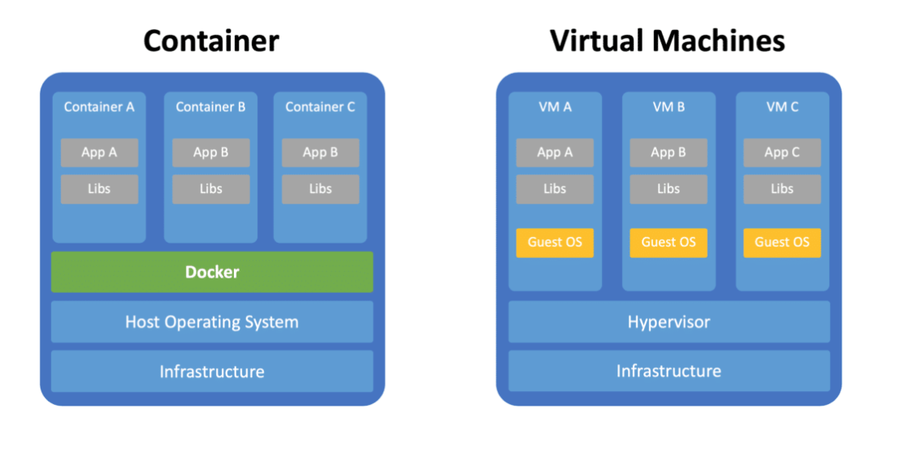

# What is a Docker and why do you need it?

Docker is a popular tool to make it easier to build, deploy and run applications using containers. Containers allow us to package all the things that our application needs like such as libraries and other dependencies and ship it all as a single package.

In this way, our application can be run on any machine and have the same behavior.

Putting applications into containers leads to several advantages:

 * Docker containers are always portable. This means that you can build containers locally and deploy containers to any docker environment (other computers, servers, cloud, etc …)

 * Containers are lightweight because containers are sharing the host kernel (the host operating system) but can also handle the most complex applications

 * Containers are stackable, services can be stacked vertically and on-the-fly.

## Containers vs Virtual Machines

  

The Docker container platform is always running on top of the host operating system. Containers are containing the binaries, libraries, and the application itself.

Containers do not contain a guest operating system which ensures that containers are lightweight.

In contrast virtual machines are running on a hypervisor (responsible for running virtual machines) and include it’s own guest operating system.

This increased the size of the virtual machines significantly, makes setting up virtual machines more complex and requires more resources to run each virtual machine.

## How to install Docker

* [Install Docker for Mac](https://docs.docker.com/docker-for-mac/install/)

* [Install Docker for Windows](https://docs.docker.com/docker-for-windows/install/)

* [Install Docker for Ubuntu](https://docs.docker.com/engine/install/ubuntu/)

You can follow [this](https://medium.com/codingthesmartway-com-blog/docker-beginners-guide-part-1-images-containers-6f3507fffc98) blog to learn more with practical examples

