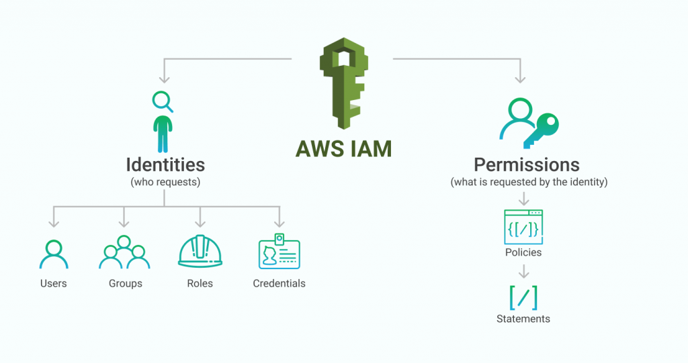

# Sample Page 
AWS is a cloud provider offering a broad variety of services in different areas: networking, compute, analytics, databases, storage and so on. It is also an API based provider, which means each service has its own API to interact with other services. Let me provide a few examples of different services that regularly interact with each other: RDS uses S3 as a storage backend for DB snapshots, Cloudwatch uses SNS for notifications, Cloudformation uses Lambda for Custom Resources.

To manage access permissions to those services AWS has created IAM service, which is responsible for 2 processes:
 - Authentication — are you the one you claim to be?
 - Authorization — are you allowed to do what you want to do?

IAM has many internal items, major among them are: 
 - Users
 - Groups
 - Roles
 - Policies

<p align="center">  </p>

## How to use 
Let me start with an example. Imagine you want to create an S3 bucket using AWS CLI. Assuming you have installed AWS CLI on your local machine, you can write ```aws s3 mb s3://new_bucket``` on your terminal. For the S3 bucket to be created, many steps must be completed on the backend side, which many of them directly involve IAM service. After checking your credentials by AWS CLI, it makes a call with the provided credentials. Here is when AWS IAM service enters into the picture, it first checks if you are authenticated (e.g. check if API key/secret combination is correct and exists in IAM database), then it evaluates if you are authorized to perform such task (checking policies attached to your IAM account to see if you have permission to access S3 and create a bucket).If you are authenticated and authorized, then your call will go to AWS S3 API and a new bucket will be created and a response will be sent to you. 


## Resources 
- Official documentation source for the AWS Identity and Access Management (IAM) User Guide: [Link](https://github.com/awsdocs/iam-user-guide)
- Medium article: AWS IAM Deep Dive: [Link](https://medium.com/@thomas.storm/aws-iam-deep-dive-chapter-1-essentials-a9cfb1931a01)


## Pain Points 
- Identify current problems and paint points surround this topic / tool. What problems are people looking to solve around or with this topic/tool?
- 


