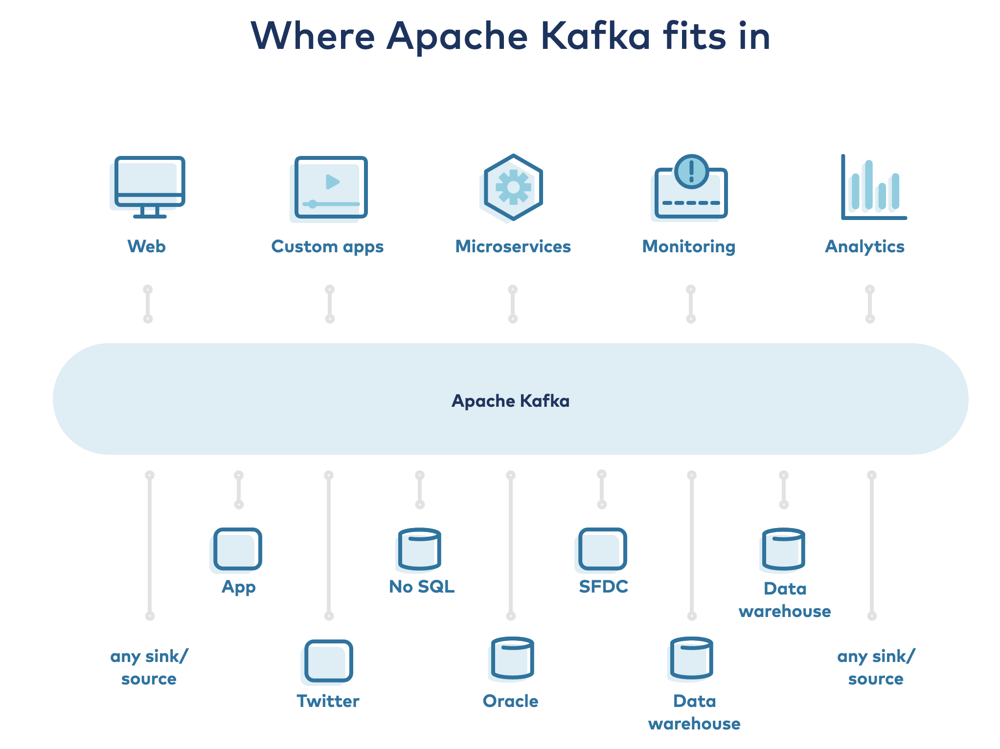
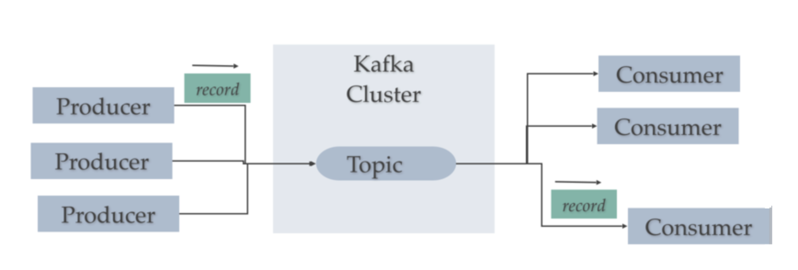

# Kafka

Apache Kafka is a community distributed event streaming platform capable of handling trillions of events a day. Initially conceived as a messaging queue, Kafka is based on an abstraction of a distributed commit log. Since being created and open sourced by LinkedIn in 2011, Kafka has quickly evolved from messaging queue to a full-fledged event streaming platform. 

A streaming platform has three key capabilities:

- Publish and subscribe to streams of records, similar to a message queue or enterprise messaging system.
- Store streams of records in a fault-tolerant durable way.
- Process streams of records as they occur.

Kafka is generally used for two broad classes of applications:

- Building real-time streaming data pipelines that reliably get data between systems or applications
- Building real-time streaming applications that transform or react to the streams of data.

To understand how Kafka does these things, let's dive in and explore Kafka's capabilities from the bottom up.

First a few concepts:

- Kafka runs as a cluster on one or more servers that can span multiple datacenters.
- The Kafka cluster stores streams of records in categories called topics.
- Each record consists of a key, a value, and a timestamp.

Kafka has five core APIs:

- The Producer API: allows an application to publish a stream of records to one or more Kafka topics.

- The Consumer API: allows an application to subscribe to one or more topics and process the stream of records produced to them.

- The Streams API: allows an application to act as a stream processor, consuming an input stream from one or more topics and producing an output stream to one or more output topics, effectively transforming the input streams to output streams.

- The Connector API: allows building and running reusable producers or consumers that connect Kafka topics to existing applications or data systems. For example, a connector to a relational database might capture every change to a table.

- The Admin API: allows managing and inspecting topics, brokers and other Kafka objects

In Kafka the communication between the clients and the servers is done with a simple, high-performance, language agnostic TCP protocol. This protocol is versioned and maintains backwards compatibility with older versions

## Architecture of Kafka

Kafka consists of Records, Topics, Consumers, Producers, Brokers, Logs, Partitions, and Clusters. Records can have key (optional), value and timestamp. Kafka Records are immutable. A Kafka Topic is a stream of records ("/orders", "/user-signups"). You can think of a Topic as a feed name. A topic has a Log which is the topic’s storage on disk. A Topic Log is broken up into partitions and segments. The Kafka Producer API is used to produce streams of data records. The Kafka Consumer API is used to consume a stream of records from Kafka. A Broker is a Kafka server that runs in a Kafka Cluster. Kafka Brokers form a cluster. The Kafka Cluster consists of many Kafka Brokers on many servers. Broker sometimes refer to more of a logical system or as Kafka as a whole.

A Kafka cluster is made up of multiple Kafka Brokers. Each Kafka Broker has a unique ID (number). Kafka Brokers contain topic log partitions. Connecting to one broker bootstraps a client to the entire Kafka cluster. For failover, you want to start with at least three to five brokers. A Kafka cluster can have, 10, 100, or 1,000 brokers in a cluster if needed.

Kafka uses ZooKeeper to manage the cluster. ZooKeeper is used to coordinate the brokers/cluster topology. ZooKeeper is a consistent file system for configuration information. ZooKeeper gets used for leadership election for Broker Topic Partition Leaders.

## Use Cases

### Messaging

Kafka works well as a replacement for a more traditional message broker. Message brokers are used for a variety of reasons (to decouple processing from data producers, to buffer unprocessed messages, etc). In comparison to most messaging systems Kafka has better throughput, built-in partitioning, replication, and fault-tolerance which makes it a good solution for large scale message processing applications.

In our experience messaging uses are often comparatively low-throughput, but may require low end-to-end latency and often depend on the strong durability guarantees Kafka provides.

In this domain Kafka is comparable to traditional messaging systems such as ActiveMQ or RabbitMQ.

### Website Activity Tracking

The original use case for Kafka was to be able to rebuild a user activity tracking pipeline as a set of real-time publish-subscribe feeds. This means site activity (page views, searches, or other actions users may take) is published to central topics with one topic per activity type. These feeds are available for subscription for a range of use cases including real-time processing, real-time monitoring, and loading into Hadoop or offline data warehousing systems for offline processing and reporting.

Activity tracking is often very high volume as many activity messages are generated for each user page view.

### Metrics

Kafka is often used for operational monitoring data. This involves aggregating statistics from distributed applications to produce centralized feeds of operational data.

### Log Aggregation

Many people use Kafka as a replacement for a log aggregation solution. Log aggregation typically collects physical log files off servers and puts them in a central place (a file server or HDFS perhaps) for processing. Kafka abstracts away the details of files and gives a cleaner abstraction of log or event data as a stream of messages. This allows for lower-latency processing and easier support for multiple data sources and distributed data consumption. In comparison to log-centric systems like Scribe or Flume, Kafka offers equally good performance, stronger durability guarantees due to replication, and much lower end-to-end latency.

### Stream Processing

Many users of Kafka process data in processing pipelines consisting of multiple stages, where raw input data is consumed from Kafka topics and then aggregated, enriched, or otherwise transformed into new topics for further consumption or follow-up processing. For example, a processing pipeline for recommending news articles might crawl article content from RSS feeds and publish it to an "articles" topic; further processing might normalize or deduplicate this content and publish the cleansed article content to a new topic; a final processing stage might attempt to recommend this content to users. Such processing pipelines create graphs of real-time data flows based on the individual topics. Starting in 0.10.0.0, a light-weight but powerful stream processing library called Kafka Streams is available in Apache Kafka to perform such data processing as described above. Apart from Kafka Streams, alternative open source stream processing tools include Apache Storm and Apache Samza.

### Event Sourcing

Event sourcing is a style of application design where state changes are logged as a time-ordered sequence of records. Kafka's support for very large stored log data makes it an excellent backend for an application built in this style.

### Commit Log

Kafka can serve as a kind of external commit-log for a distributed system. The log helps replicate data between nodes and acts as a re-syncing mechanism for failed nodes to restore their data. The log compaction feature in Kafka helps support this usage. In this usage Kafka is similar to Apache BookKeeper project.

## Resources 

The best way to run Kafka on Kubernetes is using [Confluent Operator](https://docs.confluent.io/current/installation/operator/index.html#operator-about-intro)

Confluent Operator allows you to deploy and manage Confluent Platform as a cloud-native, stateful container application on Kubernetes and OpenShift. The automation provided by Kubernetes, Operator, and Helm greatly simplifies provisioning and minimizes the burden of operating and managing Confluent Platform clusters. Operator also provides you with the portability to use Apache Kafka® in multiple provider zones and across both your private and public cloud environments. 

The video provides an introduction to the confluent operator - [Introduction](https://www.youtube.com/watch?v=P_DEreC4ECw&feature=emb_logo)

Some key features of confluent operator include:

### Deploying

- Automates Confluent Platform deployment using Helm.
- Automates Confluent Platform management.
- Uses default Kubernetes StorageClass-based provisioners for persistent volume storage (such as Google persistent disks, AWS EBS, and Azure disk storage).
- Automates cluster authentication and security configuration using:
- SASL/PLAIN with TLS certificates
- TLS two-way (mutual) authentication
- TLS in-transit encryption for all deployed components.

### Updating and Upgrading

- Provides automated rolling updates for configuration changes.
- Provides automated rolling upgrades with no impact to Kafka availability.

### Scaling 

- Provides elastic scaling for new Confluent Platform components (with manual rebalancing).

### Resiliency

- Restores a Kafka pod with the same Kafka broker ID, configuration, and persistent storage volumes if a failure occurs.

### Monitoring

- Supports metrics aggregation using JMX/Jolokia.
- Supports aggregated metrics export to Prometheus.

The following shows the high-level architecture of Operator and Confluent Platform components in a Kubernetes cluster.

## Pain Points 

- **Machine Requirments**
Confluent operator must require adequate disk, number of cpu's to run. So a 10 node EKS cluster was found to be successful in my project case. The EC-2 instances which were t2.large instances.

- **Exposing the service as a Load Balancer**
To connect with the kafka brokers externally , it is important to correctly configure the external IP's in the file.