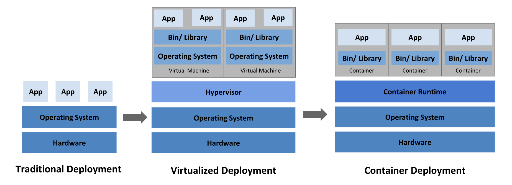
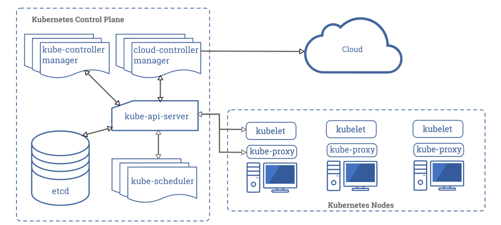

# Kubernetes
Kubernetes is a portable, extensible, open-source platform for managing containerized workloads and services, that facilitates both declarative configuration and automation. It has a large, rapidly growing ecosystem. Kubernetes services, support, and tools are widely available.

The name Kubernetes originates from Greek, meaning helmsman or pilot. Google open-sourced the Kubernetes project in 2014. Kubernetes combines over 15 years of Google's experience running production workloads at scale with best-of-breed ideas and practices from the community

## Comparing the Deployment era 

Traditional deployment era: Early on, organizations ran applications on physical servers. There was no way to define resource boundaries for applications in a physical server, and this caused resource allocation issues. For example, if multiple applications run on a physical server, there can be instances where one application would take up most of the resources, and as a result, the other applications would underperform. A solution for this would be to run each application on a different physical server. But this did not scale as resources were underutilized, and it was expensive for organizations to maintain many physical servers.

Virtualized deployment era: As a solution, virtualization was introduced. It allows you to run multiple Virtual Machines (VMs) on a single physical server's CPU. Virtualization allows applications to be isolated between VMs and provides a level of security as the information of one application cannot be freely accessed by another application.

Virtualization allows better utilization of resources in a physical server and allows better scalability because an application can be added or updated easily, reduces hardware costs, and much more. With virtualization you can present a set of physical resources as a cluster of disposable virtual machines.

Each VM is a full machine running all the components, including its own operating system, on top of the virtualized hardware.

Container deployment era: Containers are similar to VMs, but they have relaxed isolation properties to share the Operating System (OS) among the applications. Therefore, containers are considered lightweight. Similar to a VM, a container has its own filesystem, CPU, memory, process space, and more. As they are decoupled from the underlying infrastructure, they are portable across clouds and OS distributions.

Containers have become popular because they provide extra benefits, such as:

- Agile application creation and deployment: increased ease and efficiency of container image creation compared to VM image use.
Continuous development, integration, and deployment: provides for reliable and frequent container image build and deployment with quick and easy rollbacks (due to image immutability).

- Dev and Ops separation of concerns: create application container images at build/release time rather than deployment time, thereby decoupling applications from infrastructure.
Observability not only surfaces OS-level information and metrics, but also application health and other signals.
Environmental consistency across development, testing, and production: Runs the same on a laptop as it does in the cloud.
Cloud and OS distribution portability: Runs on Ubuntu, RHEL, CoreOS, on-premises, on major public clouds, and anywhere else.

- Application-centric management: Raises the level of abstraction from running an OS on virtual hardware to running an application on an OS using logical resources.
Loosely coupled, distributed, elastic, liberated micro-services: applications are broken into smaller, independent pieces and can be deployed and managed dynamically – not a monolithic stack running on one big single-purpose machine.
Resource isolation: predictable application performance.
Resource utilization: high efficiency and density.

## Why you need Kuberntes and what it can do?

Containers are a good way to bundle and run your applications. In a production environment, you need to manage the containers that run the applications and ensure that there is no downtime. For example, if a container goes down, another container needs to start. Wouldn't it be easier if this behavior was handled by a system?

That's how Kubernetes comes to the rescue! Kubernetes provides you with a framework to run distributed systems resiliently. It takes care of scaling and failover for your application, provides deployment patterns, and more. For example, Kubernetes can easily manage a canary deployment for your system.

Kubernetes provides you with:

- Service discovery and load balancing:
Kubernetes can expose a container using the DNS name or using their own IP address. If traffic to a container is high, Kubernetes is able to load balance and distribute the network traffic so that the deployment is stable.

- Storage orchestration:
Kubernetes allows you to automatically mount a storage system of your choice, such as local storages, public cloud providers, and more.
Automated rollouts and rollbacks.
You can describe the desired state for your deployed containers using Kubernetes, and it can change the actual state to the desired state at a controlled rate. For example, you can automate Kubernetes to create new containers for your deployment, remove existing containers and adopt all their resources to the new container.

- Automatic bin packing:
You provide Kubernetes with a cluster of nodes that it can use to run containerized tasks. You tell Kubernetes how much CPU and memory (RAM) each container needs. Kubernetes can fit containers onto your nodes to make the best use of your resources.

- Self-healing:
Kubernetes restarts containers that fail, replaces containers, kills containers that don’t respond to your user-defined health check, and doesn’t advertise them to clients until they are ready to serve.
Secret and configuration management
Kubernetes lets you store and manage sensitive information, such as passwords, OAuth tokens, and SSH keys. You can deploy and update secrets and application configuration without rebuilding your container images, and without exposing secrets in your stack configuration.

## Kubernetes Components

When you deploy Kubernetes, you get a cluster.A Kubernetes cluster consists of a set of worker machines, called nodes, that run containerized applications. Every cluster has at least one worker node.

The worker node(s) host the Pods that are the components of the application workload. The control plane manages the worker nodes and the Pods in the cluster. In production environments, the control plane usually runs across multiple computers and a cluster usually runs multiple nodes, providing fault-tolerance and high availability.

This document outlines the various components you need to have a complete and working Kubernetes cluster.

Here's the diagram of a Kubernetes cluster with all the components tied together.

### Control Plane Components

The control plane's components make global decisions about the cluster (for example, scheduling), as well as detecting and responding to cluster events (for example, starting up a new pod when a deployment's replicas field is unsatisfied).

#### Kube-apiserver

The API server is a component of the Kubernetes control plane that exposes the Kubernetes API. The API server is the front end for the Kubernetes control plane.

The main implementation of a Kubernetes API server is kube-apiserver. kube-apiserver is designed to scale horizontally—that is, it scales by deploying more instances. You can run several instances of kube-apiserver and balance traffic between those instances.

#### etcd

Consistent and highly-available key value store used as Kubernetes' backing store for all cluster data.

If your Kubernetes cluster uses etcd as its backing store, make sure you have a back up plan for those data.

#### Kube-scheduler

Control plane component that watches for newly created Pods with no assigned node, and selects a node for them to run on.

#### kube-controller-manager

Control Plane component that runs controller processes.

Logically, each controller is a separate process, but to reduce complexity, they are all compiled into a single binary and run in a single process.

These controllers include:

Node controller: Responsible for noticing and responding when nodes go down.
Replication controller: Responsible for maintaining the correct number of pods for every replication controller object in the system.
Endpoints controller: Populates the Endpoints object (that is, joins Services & Pods).
Service Account & Token controllers: Create default accounts and API access tokens for new namespaces.

#### cloud-controller-manager

A Kubernetes control plane component that embeds cloud-specific control logic. The cloud controller manager lets you link your cluster into your cloud provider's API, and separates out the components that interact with that cloud platform from components that just interact with your cluster.

The cloud-controller-manager only runs controllers that are specific to your cloud provider. If you are running Kubernetes on your own premises, or in a learning environment inside your own PC, the cluster does not have a cloud controller manager.

### Node Components

Node components run on every node, maintaining running pods and providing the Kubernetes runtime environment

#### kubelet

An agent that runs on each node in the cluster. It makes sure that containers are running in a Pod.

The kubelet takes a set of PodSpecs that are provided through various mechanisms and ensures that the containers described in those PodSpecs are running and healthy. The kubelet doesn’t manage containers which were not created by Kubernetes.

#### kube-proxy 

kube-proxy is a network proxy that runs on each node in your cluster, implementing part of the Kubernetes Service concept.

kube-proxy maintains network rules on nodes. These network rules allow network communication to your Pods from network sessions inside or outside of your cluster.

kube-proxy uses the operating system packet filtering layer if there is one and it's available. Otherwise, kube-proxy forwards the traffic itself.

#### Container runtime

The container runtime is the software that is responsible for running containers.

## How to use 

### For your local machine

For getting started with Kubernetes for a learning environment on your machine locally you can use Minikube. 

Minikube is a tool that makes it easy to run Kubernetes locally. Minikube runs a single-node Kubernetes cluster inside a Virtual Machine (VM) on your laptop for users looking to try out Kubernetes or develop with it day-to-day.

First, you have to [Install Minikube](https://kubernetes.io/docs/tasks/tools/install-minikube/)

Then , using Minikube you can start your [local Kubernetes Cluster](https://kubernetes.io/docs/setup/learning-environment/minikube/)

### Using Cloud provided service like Amazon Elastic Kubernetes Service (Amazon EKS)

Amazon Elastic Kubernetes Service (Amazon EKS) is a managed service that makes it easy for you to run Kubernetes on AWS without needing to stand up or maintain your own Kubernetes control plane.

Amazon EKS runs Kubernetes control plane instances across multiple Availability Zones to ensure high availability. Amazon EKS automatically detects and replaces unhealthy control plane instances, and it provides automated version upgrades and patching for them.

You can get started with Amazon EKS using [eksctl](https://docs.aws.amazon.com/eks/latest/userguide/getting-started-eksctl.html), a simple command line utility for creating and managing Kubernetes clusters on Amazon EKS. 

## Resources 
- Here's a very good resource of using Terraform to [provision your Amazon EKS Cluster](https://learn.hashicorp.com/terraform/kubernetes/provision-eks-cluster).
- Setup Applications using this [Kubernetes Tutorial](https://kubernetes.io/docs/tutorials/)

## Pain Points 

- **Deploying EKS Cluster using Terraform**

Take care about the IAM permissions after the Terraform apply command. If you working as IAM user in AWS, then make sure to give Full Access to the user otherwise it would prompt a  lot of errors.

