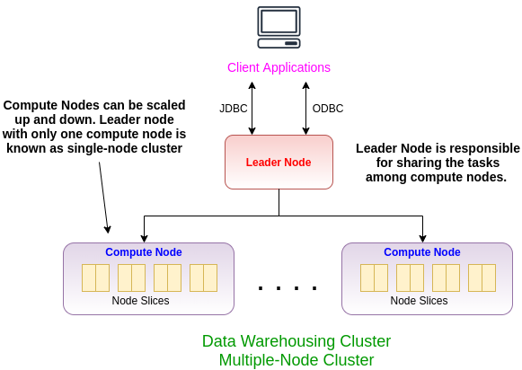

# What is Amazon Redshift?
Amazon Redshift is a cloud-based relational database system built on PostgreSQL principles. It’s optimized for performing online analytical processing (“OLAP”) queries efficiently over petabytes of data. The query handling efficiency is achieved through the combination of:
- highly parallel processing
- a columnar database design
- data compression of columns

# Architecture
The heart of each Redshift deployment is a cluster. Each cluster has a leader node and one or more compute nodes, all connected by high speed links. A leader node is the interface to your business intelligence application. It offers standard PostgreSQL JDBC/ODBC interfaces for queries and responses. It serves as the traffic cop directing queries from customer applications to the appropriate compute nodes, and manages the results returned. It also distributes ingested data into the compute nodes to build your databases.

  

The Dense Compute (DC) nodes are meant for speed of query execution, with less storage, and is best for high performance activities. It is implemented with SSD drives. The Dense Storage (DS) nodes are for storing and querying big data, using typical hard disk drives.

## How to use 
As described in the step by step guide of official Amazon Redshift page, it involves:
 - Step 1: Set Up Prerequisites
 - Step 2: Launch a Sample Amazon Redshift Cluster
 - Step 3: Authorize Access to the Cluster
 - Step 4: Connect to the Sample Cluster (It is important to select the right connector, e.g.JDBC,ODBC,...)

## Resources 
- Medium article: Amazon Redshift: Data Warehousing for the Masses [Link](https://medium.com/intermix-io/amazon-redshift-data-warehousing-for-the-masses-ea1642dc63ea)
- Amazon Documentation: Getting Started [Link] (https://docs.aws.amazon.com/redshift/latest/gsg/getting-started.html)
- Amazon Documentation: List of all JDBC connectors per version [Link](http://docs.aws.amazon.com/redshift/latest/mgmt/configure-jdbc-connection.html)

## Pain Points 
- TBD
- 

