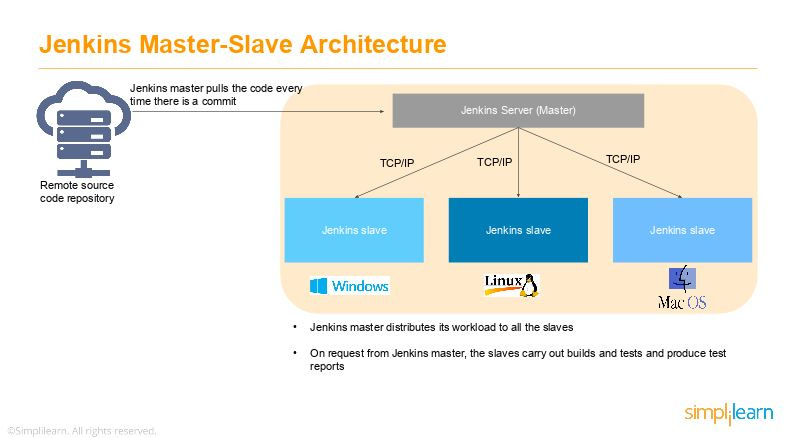

# Jenkins
Jenkins is a self-contained, open source automation server which can be used to automate all sorts of tasks related to building, testing, and delivering or deploying software. Jenkins can be installed through native system packages, Docker, or even run standalone by any machine with a Java Runtime Environment (JRE) installed.

## Overview
As a Continuous Integration tool, Jenkins allows seamless, ongoing development, testing, and deployment of newly created code. Continuous Integration is a process wherein developers commit changes to source code from a shared repository, and all the changes to the source code are built continuously. This can occur multiple times daily. Each commit is continuously monitored by the CI Server, increasing the efficiency of code builds and verification. This removes the testers' burdens, permitting quicker integration and fewer wasted resources.

### Why Jenkins?

#### Easy Installation
Jenkins is a platform-agnostic, self-contained Java-based program, ready to run with packages for Windows, Mac OS, and Unix-like operating systems.

#### Easy Configuration
Jenkins is easily set up and configured using its web interface, featuring error checks and a built-in help function.

#### Available Plugins
There are hundreds of plugins available in the Update Center, integrating with every tool in the CI and CD toolchain.

#### Extensible
Jenkins can be extended by means of its plugin architecture, providing nearly endless possibilities for what it can do.

#### Easy Distribution
Jenkins can easily distribute work across multiple machines for faster builds, tests, and deployments across multiple platforms.

#### Free Open Source
Jenkins is an open-source resource backed by heavy community support.

### Jenkins Architecture
Here's how Jenkins elements are put together and interact:

- Developers commit changes to the source code, found in the repository.
The Jenkins CI server checks the repository at regular intervals and pulls any newly available code.
- The Build Server builds the code into an executable file. In case the build fails, feedback is sent to the developers.
- Jenkins deploys the build application to the test server. If the test fails, the developers are alerted.
- If the code is error-free, the tested application is deployed on the production server.
 
### Jenkins Master-Slave Architecture


- The Jenkins server accesses the master environment on the left side and the master environment can push down to multiple other Jenkins Slave environments to distribute the workload. 
- That lets you run multiple builds, tests, and product environments across the entire architecture. Jenkins Slaves can be running different build versions of the code for different operating systems and the server Master controls how each of the builds operates. 
- Supported on a master-slave architecture, Jenkins comprises many slaves working for a master. This architecture - the Jenkins Distributed Build - can run identical test cases in different environments. Results are collected and combined on the master node for monitoring.


## Installation
### Downloading and running Jenkins in Docker
#### Download Jenkins Docker image either “jenkins/jenkins” or “jenkinsci/blueocean“
    
#### On MacOS and Linux
1. Open up a terminal window.
2. Create a bridge network in Docker using the following docker network create command:
```
docker network create jenkins
```
3. Create the following volumes to share the Docker client TLS certificates needed to connect to the Docker daemon and persist the Jenkins data using the following docker volume create commands:
```
docker volume create jenkins-docker-certs
docker volume create jenkins-data
```
4. In order to execute Docker commands inside Jenkins nodes, download and run the docker:dind Docker image using the following docker container run command:
```
docker container run \
  --name jenkins-docker \
  --rm \
  --detach \
  --privileged \
  --network jenkins \
  --network-alias docker \
  --env DOCKER_TLS_CERTDIR=/certs \
  --volume jenkins-docker-certs:/certs/client \
  --volume jenkins-data:/var/jenkins_home \
  --publish 2376:2376 \
  docker:dind
```

or

```
docker container run --name jenkins-docker --rm --detach \
  --privileged --network jenkins --network-alias docker \
  --env DOCKER_TLS_CERTDIR=/certs \
  --volume jenkins-docker-certs:/certs/client \
  --volume jenkins-data:/var/jenkins_home \
  --publish 2376:2376 docker:dind
```

5. Download the jenkinsci/blueocean image and run it as a container in Docker using the following docker container run command:
```
docker container run \
  --name jenkins-blueocean \
  --rm \
  --detach \
  --network jenkins \
  --env DOCKER_HOST=tcp://docker:2376 \
  --env DOCKER_CERT_PATH=/certs/client \
  --env DOCKER_TLS_VERIFY=1 \
  --publish 8080:8080 \
  --publish 50000:50000 \
  --volume jenkins-data:/var/jenkins_home \
  --volume jenkins-docker-certs:/certs/client:ro \
  jenkinsci/blueocean
```

or

```
docker container run --name jenkins-blueocean --rm --detach \
  --network jenkins --env DOCKER_HOST=tcp://docker:2376 \
  --env DOCKER_CERT_PATH=/certs/client --env DOCKER_TLS_VERIFY=1 \
  --volume jenkins-data:/var/jenkins_home \
  --volume jenkins-docker-certs:/certs/client:ro \
  --publish 8080:8080 --publish 50000:50000 jenkinsci/blueocean
```
#### Accessing the Jenkins/Blue Ocean Docker container

```
docker container exec -it jenkins-blueocean bash
```

#### Accessing the Jenkins console log through Docker logs

```
docker container logs <docker-container-name>
```

#### Accessing the Jenkins home directory

```
docker container exec -it <docker-container-name> bash
```

## Resources 
- Official Website - https://www.jenkins.io/
- What is Jenkins? - https://www.simplilearn.com/tutorials/jenkins-tutorial/what-is-jenkins
- Official tutorial for jenkins with instructions for jenkins pipeline: https://www.jenkins.io/doc/tutorials/

## Pain Points 
1. The load that jenkins can take depends on factors beyond just the number of build jobs you run. It can get dragged down if you keep a lot of build history stored in the tool, if you do a high number of builds per day, or if you integrate with many external services.

2. Jenkins has a lot of redundant plugins. Knowing which one to use takes some experimentation and failed attempts.

