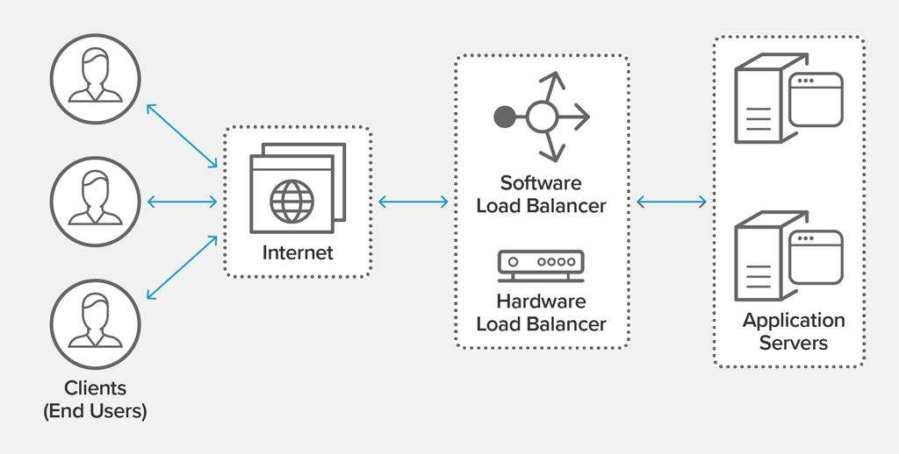
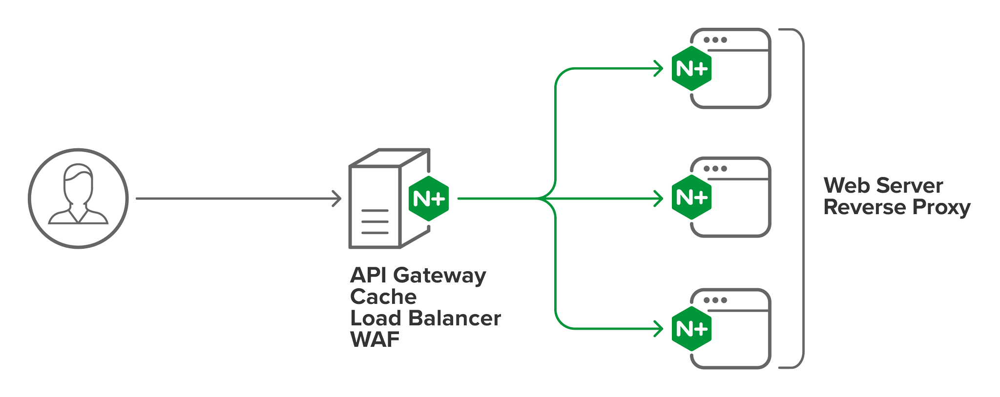
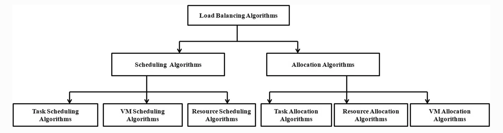
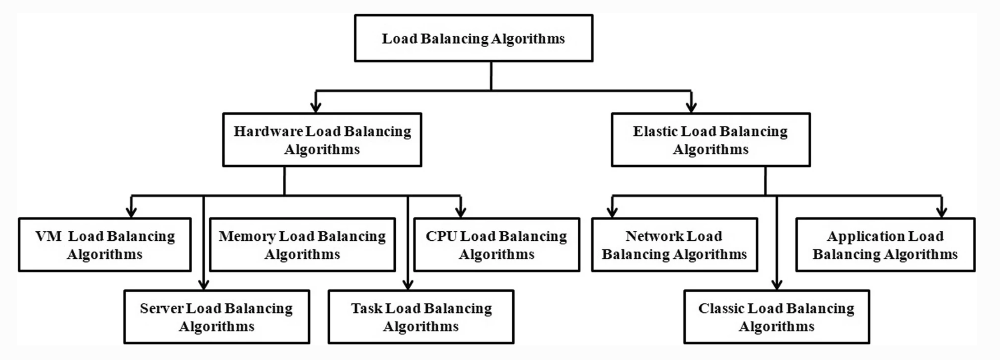

# Load Balancers 

## What are Load Balancers?

Load Balancing Definition:
 
Load balancing is the process of distributing network traffic across multiple servers. This ensures no single server bears too much demand. By spreading the work evenly, load balancing improves application responsiveness. It also increases availability of applications and websites for users. Modern applications cannot run without load balancers. 

Software load balancers have added additional capabilities including security and application.

## Hardware vs Software Load Balancers

Hardware-based  load balancers work as follows:

* They are typically high-performance appliances, capable of securely processing multiple gigabits of traffic from various types of applications.
* These appliances may also contain built-in virtualization capabilities, which consolidate numerous virtual load balancer instances on the same hardware.
* That allows for more flexible multi-tenant architectures and full isolation of tenants, among other benefits.

In contrast, software-based load balancers:

* Can fully replace load balancing hardware while delivering analogous functionality and superior flexibility.
* May run on common hypervisors, in containers or as Linux processes with minimal overhead on bare-metal servers and are highly configurable depending on the use cases and technical requirements in question.
* Can save space and reduce hardware expenditures.

## DNS vs Hardware Load Balancing

DNS load balancing is a software-defined approach to load balancing where client requests to a domain within the Domain Name System (DNS) are distributed across different server machines. The DNS system sends a different version of the list of IP addresses each time it responds to a new client request using the round-robin method, therefore distributing the DNS requests evenly to different servers to handle the overall load. This in turn provides DNS load balancing failover protection through automatic removal of non-responsive servers.

A DNS load balancer distributes traffic to several different IP addresses, whereas the hardware solution uses a single IP address and splits traffic leading to it on multiple servers. As for pricing, hardware load balancers require a large upfront cost whereas DNS load balancers can be scaled as needed.

## Cloud Load Balancing

Cloud Computing is becoming the most advanced technology providing the world with resources like storage, computation power, dynamic allocation of resources based on demand. 

Cloud load balancing is one of the main technology which helps distribute the dynamic workloads and computing resources in cloud environment between the resources evenly. 

Load balancing is the process of redistribution of workload in a distributed system like cloud computing ensuring no computing machine is overloaded, under-loaded or idle. Load balancing tries to speed up different constrained parameters like response time, execution time, system stability etc. thereby improving performance of cloud. It is an optimization technique in which task scheduling is an NP hard problem. There are a large number of load balancing approaches proposed by researchers where most of focus has been concerned on task scheduling, task allocation, resource scheduling, resource allocation, and resource management.

Modern high‑traffic websites must serve hundreds of thousands, if not millions, of concurrent requests from users or clients and return the correct text, images, video, or application data, all in a fast and reliable manner. To cost‑effectively scale to meet these high volumes, modern computing best practice generally requires adding more servers.

A load balancer acts as the “traffic cop” sitting in front of your servers and routing client requests across all servers capable of fulfilling those requests in a manner that maximizes speed and capacity utilization and ensures that no one server is overworked, which could degrade performance. If a single server goes down, the load balancer redirects traffic to the remaining online servers. When a new server is added to the server group, the load balancer automatically starts to send requests to it.

In this manner, a load balancer performs the following functions:

* Distributes client requests or network load efficiently across multiple servers
* Ensures high availability and reliability by sending requests only to servers that are online
* Provides the flexibility to add or subtract servers as demand dictates

## Modern Load Balancer: An Example

NGINX Plus is an example of a modern software load balancer which acts as a load balancer, a web server, and a content cache -- all bundled into one application. 

## History

Load balancing got its start in the 1990s as hardware appliances distributing traffic across a network. Organizations wanted to improve accessibility of applications running on servers. Eventually, load balancing took on more responsibilities with the advent of Application Delivery Controllers (ADCs). They provide security along with seamless access to applications at peak times.

ADCs fall into three categories: hardware appliances, virtual appliances (essentially the software extracted from legacy hardware) and software-native load balancers. 

As computing moves to the cloud, software ADCs perform similar tasks to hardware. They also come with added functionality and flexibility. They let an organization quickly and securely scale up its application services based on demand in the cloud. 

Modern ADCs allow organizations to consolidate network-based services. Those services include SSL/TLS offload, caching, compression, intrusion detection and web application firewalls. This creates even shorter delivery times and greater scalability.

## Benefits of Load Balancing

Benefits of Load Balancing
* Reduced Downtime
* Scalable
* Redundancy
* Flexibility
* Efficiency
* Global Server Load Balancing

## The OSI Model & Load Balancers

In the seven-layer Open System Interconnection (OSI) model, network firewalls are at levels one to three (L1-Physical Wiring, L2-Data Link and L3-Network).

Load balancing happens between layers four to seven (L4-Transport, L5-Session, L6-Presentation and L7-Application).

Load balancers have different capabilities, which include:

* L4 — directs traffic based on data from network and transport layer protocols, such as IP address and TCP port.
* L7 — adds content switching to load balancing. This allows routing decisions based on attributes like HTTP header, uniform resource identifier, SSL session ID and HTML form data.
* GSLB — Global Server Load Balancing extends L4 and L7 capabilities to servers in different geographic locations.

## Types of Load Balancing

* SDN — Load balancing using SDN (software-defined networking) separates the control plane from the data plane for application delivery. This allows the control of multiple load balancing. It also helps the network to function like the virtualized versions of compute and storage. With the centralized control, networking policies and parameters can be programmed directly for more responsive and efficient application services. This is how networks can become more agile.
* UDP — A UDP load balancer utilizes User Datagram Protocol (UDP). UDP load balancing is often used for live broadcasts and online games when speed is important and there is little need for error correction. UDP has low latency because it does not provide time-consuming health checks.
* TCP — A TCP load balancer uses transmission control protocol (TCP). TCP load balancing provides a reliable and error-checked stream of packets to IP addresses, which can otherwise easily be lost or corrupted.
* SLB — Server Load Balancing (SLB) provides network services and content delivery using a series of load balancing algorithms. It prioritizes responses to the specific requests from clients over the network. Server load balancing distributes client traffic to servers to ensure consistent, high-performance application delivery.
* Virtual — Virtual load balancing aims to mimic software-driven infrastructure through virtualization. It runs the software of a physical load balancing appliance on a virtual machine. Virtual load balancers, however, do not avoid the architectural challenges of traditional hardware appliances which include limited scalability and automation, and lack of central management.
* Elastic — Elastic Load Balancing scales traffic to an application as demand changes over time. It uses system health checks to learn the status of application pool members (application servers) and routes traffic appropriately to available servers, manages fail-over to high availability targets, or automatically spins-up additional capacity.
* Geographic — Geographic load balancing redistributes application traffic across data centers in different locations for maximum efficiency and security. While local load balancing happens within a single data center, geographic load balancing uses multiple data centers in many locations.
* Multi-site — Multi-site load balancing, also known as global server load balancing (GSLB), distributes traffic across servers located in multiple sites or locations around the world. The servers can be on-premises or hosted in a public or private cloud. Multi-site load balancing is important for quick disaster recovery and business continuity after a disaster in one location renders a server inoperable.
* Load Balancer as a Service (LBaaS) — Load Balancer as a Service (LBaaS) uses advances in load balancing technology to meet the agility and application traffic demands of organizations implementing private cloud infrastructure. Using an as-a-service model, LBaaS creates a simple model for application teams to spin up load balancers.

## Algorithms 

### Classification
LB algorithms are widely classified as static, dynamic and hybrid.

In static load balancing, traffic load is segregated uniformly across the servers. This is done by algorithm having the prior knowledge about system resources and task requirements. The static LB algorithm schedules tasks to VM for execution at compile time. The advantage of static algorithm is their less complexity but they suffer from a fatal bottleneck of being unable to move tasks during execution in progress to another machine for load balancing. 

Further on the basis of mode of execution of tasks, dynamic algorithms are grouped as offline mode also called as batch mode and online mode or live mode as shown in the Figure below.

In batch mode, the task is allocated only at some predefined instances where as in online mode the user task is mapped to a VM as soon it enters the scheduler. Dynamic load balancing algorithms are comparatively complex algorithms in contrast with their counterparts that handle incoming traffic flow at run time and can change state of a running task at any point of time. Dynamic load balancing takes into consideration the current state of system and has capacity to deal with unpredictable processing load. The advantage of dynamic load balancing is that tasks can move dynamically from an overloaded machine to under-loaded one but are much complex in nature and much complicated to design compared to static LB algorithms.

### Classification: Functionality
On the basis of functionality, load balancers are classified as hardware load balancer and elastic load balancer as depicted in the figure below. 

Hardware load balancers are concerned with the distribution of workload at hardware level i.e. memory, storage and CPU. Elastic Load Balancing automatically distributes incoming application traffic across multiple targets, such as Amazon EC2 instances, containers, and IP addresses. It can handle varying load of user application traffic in a single availability zone or across multiple availability zones. Elastic Load Balancing offers three types of load balancers that all feature high availability, automatic scaling, and robust security necessary to make user applications fault tolerant. 

### Elastic Load Balancers (Software-based)
Elastic Load Balancing offers two types of load balancers that all feature high availability, automatic scaling, and robust security necessary to make user applications fault tolerant. 

 Application Load Balancers  
* Operates at the request level (layer 7) routing traffic to targets - EC2 instances, containers and IP addresses based on the content of the request. 
* Ideal for advanced load balancing of HTTP and HTTPS traffic, Application Load Balancer provides advanced request routing targeted at delivery of modern application architectures, including micro-services and container-based applications. 
* Application Load Balancer simplifies and improves the security of your application, by ensuring that the latest SSL/TLS ciphers and protocols are used at all times. 
  
 Network load balancers 
* Are implemented at the transport layer of the OSI model. It has ability to handle millions of requests per second. 
* The network load balancing is popularly used by Microsoft azure and AWS in deployment model. 
* The network load balancing feature allows traffic distribution among servers using the TCP/IP internet protocol. 
 

### Technique used in load balancing
Load balancing algorithms are classified as heuristics and meta-heuristics techniques, and optimization techniques.

A heuristic approach is an approach to problem solving accounting a practical method or methodology guaranteed not be optimal, perfect, logical or rationale but sufficient to reach an immediate goal. Finding an optimal solution may be impossible or impractical particularly to load balancing which is a NP hard problem and heuristics play an important role to gear up the process of finding a decent solution. 

Optimization techniques are used to find optimal solutions of a problem. Optimization techniques in cloud load balancing are broadly classified as classical and non classical optimization techniques. These algorithms can be either stochastic or deterministic.

## List Of Top Software Load Balancers

* Nginx
* Avi Vantage Software Load Balancer
* HAProxy
* Kemp LoadMaster
* Loadbalancer.org
* ManageEngine OpManager
* Citrix ADC
* Barracuda Load Balancer ADC
* Incapsula
* Total Uptime Cloud Load Balancer
* jetNEXUS Load Balancers

## Resources 

- [A Quick Review from NGINX](https://www.nginx.com/resources/glossary/load-balancing/)
    - A simple intro from one of the top providers of load balancers.
- [A short history and review](https://avinetworks.com/what-is-load-balancing/)
    - The best resource!
- [List of Load Balancers](https://www.softwaretestinghelp.com/sofware-load-balancers/)
    - Top load balancers to consider.
- [A Survey Of Various Load Balancing Algorithms In Cloud Computing](https://papers.ssrn.com/sol3/papers.cfm?abstract_id=3579732)
    - May 2020 update on algorithms!
- [Load balancing in cloud computing](https://journalofcloudcomputing.springeropen.com/articles/10.1186/s13677-019-0146-7)
    - The most comprehensive paper on load balancers.

## Pain Points 

The key pain point is load UNBLANCING! Research is currently focused on this particular topic with the following questions:
 
- What causes the load unbalancing problem? 
- Why load balancing is the need of hour in cloud computing? 
-  What is the time complexity of load balancing algorithm?

The following factors are the causes for load unbalancing problem in IaaS clouds.

* The dynamic nature of user tasks.
* The unpredictable and probabilistic traffic flow to a cloud provider.
* Lack of robust, accurate and efficient mapper and generator function to map the tasks to the appropriate resources.
* The scheduling process itself is an NP hard problem.
* The heterogeneous nature of user tasks demanding varying resource requirements.
* The uneven and non- uniform distribution of tasks across computing resources along with their dependencies also contributes to load unbalancing situation.

