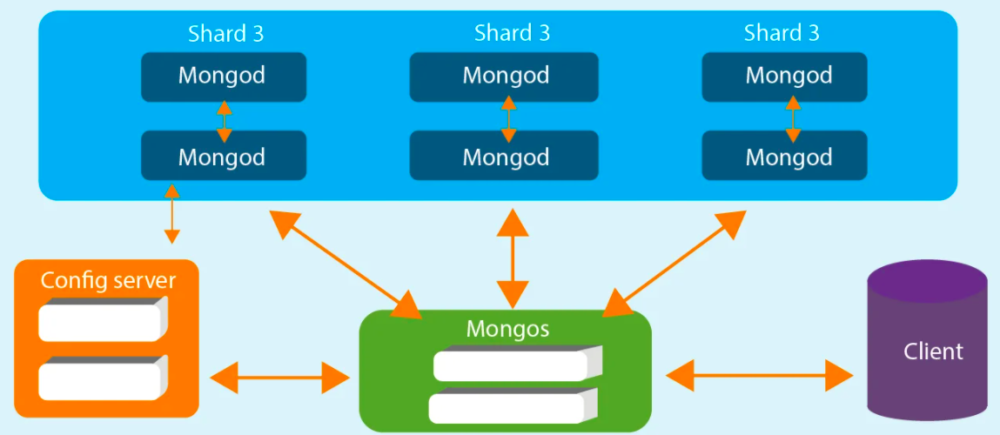
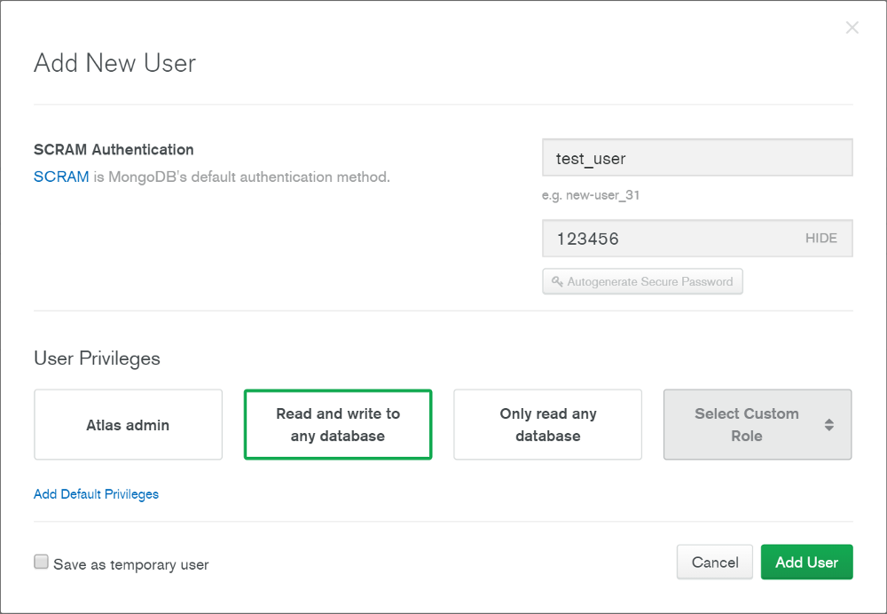
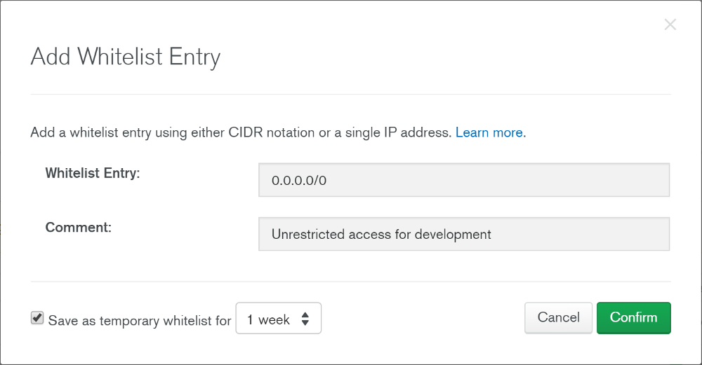
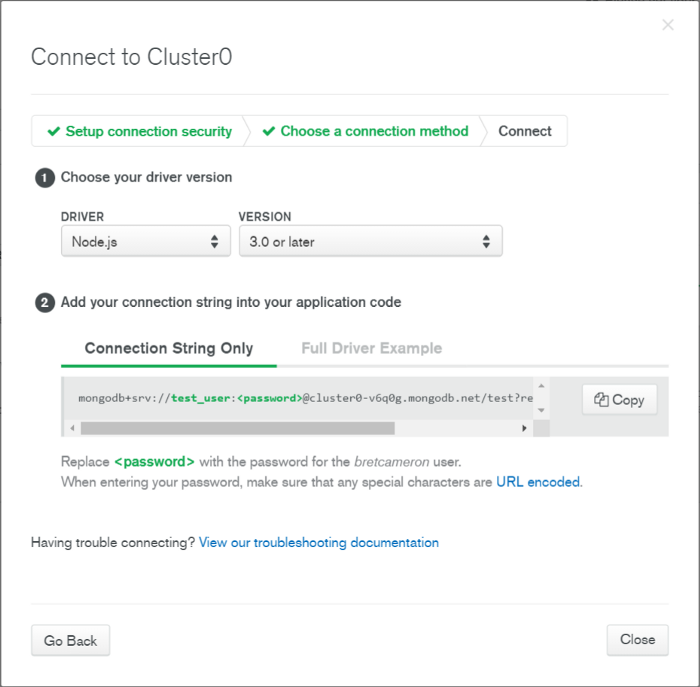

# MongoDB
MongoDB is an open-source NoSQL-Database developed in 2019 by 10gen (now MongoDB, Inc.] in C++. NoSQL is a new trend in database development and refers generally to databases without fixed schema. Such databases usually have a lower transaction safety but are faster in accessing data and scale better than relational databases. The database belongs to the category of the document-based databases. 

## Overview
MongoDB is a cross-platform, document oriented database that provides, high performance, high availability, and easy scalability. MongoDB works on the concept of collection and document.



### Why Use MongoDB?
- Document Oriented Storage − Data is stored in the form of JSON style documents.
- Index on any attribute
- Replication and high availability
- Auto-Sharding
- Rich queries
- Fast in-place updates
- Professional support by MongoDB

### Where to Use MongoDB?
- Big Data
- Content Management and Delivery
- Mobile and Social Infrastructure
- User Data Management
- Data Hub

### Database
Database is a physical container for collections. Each database gets its own set of files on the file system. A single MongoDB server typically has multiple databases.

### Collection
Collection is a group of MongoDB documents. It is the equivalent of an RDBMS table. A collection exists within a single database. Collections do not enforce a schema. Documents within a collection can have different fields. Typically, all documents in a collection are of similar or related purpose.

### Document
A document is a set of key-value pairs. Documents have a dynamic schema. Dynamic schema means that documents in the same collection do not need to have the same set of fields or structure, and common fields in a collection's documents may hold different types of data.

### Advantages of MongoDB over RDBMS
- Schema less − MongoDB is a document database in which one collection holds different documents. Number of fields, content and size of the document can differ from one document to another.
- Structure of a single object is clear.
- No complex joins.
- Deep query-ability. MongoDB supports dynamic queries on documents using a document-based query language that's nearly as powerful as SQL.
- Tuning.
- Ease of scale-out − MongoDB is easy to scale.
- Conversion/mapping of application objects to database objects not needed.
- Uses internal memory for storing the (windowed) working set, enabling faster access of data.

### Disadvantages of MongoDB
- Not the best for apps with complex transactions
- MongoDB stores key names for each value pair. Also, due to no functionality of joins, there is data redundancy. This results in increasing unnecessary usage of memory.
- Less flexibility with querying (e.g. no JOINs)

| RDBMS | MongoDB |
|-------|---------|
| Database | Database |
| Table | Collection |
| Tuple/Row | Document |
| column | Field |
| Table Join | Embedded Documents |
| Primary Key | Primary Key (Default key _id provided by MongoDB itself)|

| Database Server and Client | |
|-------|-------|
| mysqld/Oracle | mongod |
| mysql/sqlplus | mongo |

### MongoDB Atlas Beginner’s Guide

MongoDB Atlas is the official cloud database service offered by MongoDB. Here, a brief beginner’s guide is provided. 

- The first step is to create an account [here](https://www.mongodb.com/cloud/atlas).
- Once you’ve logged in successfully, you can create your own projects. 
- After creating a project, the next step is to click ‘Build a New Cluster’. 

You should see a screen like this:


If you want to use a free-tier option, Make sure to choose a region which is labelled ‘Free Tier Available’. Then scroll down and choose the ‘M0 Sandbox’ tier. This is completely free, and you’re allowed one free cluster per account.

The next step is to set up permissions. You should define users and set permissions. You can do this in the “database access” menu. Go to this menu, then click “add new user”, create a user and assign a password. You can define the user privileges here as well. 



The next step is to set network permissions. In order to access your database, you need to whitelist certain IP addresses. If you know the IP address of your users, you can assign them to your database. 



The last step is to get your database URI and use it in your application. You can go back to the clusters page and under the name of your cluster, click “connect”. From the options, choose ‘Connect Your Application’ and you’ll get a connection URI like this:




## How to use MongoDB
### Install MongoDB on Ubuntu
Run the following command to import the MongoDB public GPG key −
```
sudo apt-key adv --keyserver hkp://keyserver.ubuntu.com:80 --recv 7F0CEB10
```
Create a /etc/apt/sources.list.d/mongodb.list file using the following command.
```
echo 'deb http://downloads-distro.mongodb.org/repo/ubuntu-upstart dist 10gen' 
sudo tee /etc/apt/sources.list.d/mongodb.list
```

Now issue the following command to update the repository −
```
sudo apt-get update
```

Next install the MongoDB by using the following command −
```
apt-get install mongodb-10gen = 4.2
```

In the above installation, 2.2.3 is the currently released MongoDB version. Make sure to install the latest version. Now MongoDB is installed successfully.

### Start MongoDB
```
sudo service mongodb start
```
### Stop MongoDB
```
sudo service mongodb stop
```
### Restart MongoDB
```
sudo service mongodb restart
```
### Run MongoDB commabds
```
mongo
```

## Resources 
- https://www.tutorialspoint.com/mongodb/index.htm
- https://www.tutorialspoint.com/mongodb/mongodb_interview_questions.htm
- https://www.mongodb.com/cloud/atlas
