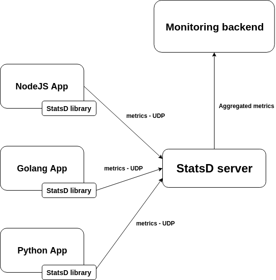

# StatsD

StatsD is a network daemon that runs on the Node.js platform and listens for statistics, like counters and timers, sent over UDP or TCP and sends aggregates to one or more pluggable backend services (e.g., Graphite).

## Overview

StatsD was originally written at Etsy and released with a blog post about how it works and why we created it.

StatsD is originally a simple daemon developed and released by Etsy to aggregate and summarize application metrics. With StatsD, applications are to be instrumented by developers using language-specific client libraries. These libraries will then communicate with the StatsD daemon using its dead-simple protocol, and the daemon will then generate aggregate metrics and relay them to virtually any graphing or monitoring backend.

Beyond the technical problem it solves—getting data from point A to point B efficiently—StatsD’s biggest contributions are organizational in nature. It allows for a culture where developers don’t have to ask anyone’s permission to instrument their application, where metrics are captured before applications are deployed in production, and where abstract performance or resource utilization metrics can be directly linked to application or product metrics that are directly relevant to the business.

The general architecture of how the StatsD daemon captures metrics is shown below.



## Installation & Configuration

### Docker
StatsD supports docker in two ways:

The official docker image on [Docker Hub](https://hub.docker.com/r/statsd/statsd)
Building the image from the bundled [Dockerfile](https://github.com/statsd/statsd/blob/master/Dockerfile)

### Manual Installation
1. Install Node.js (All Current and LTS Node.js versions are supported.)
2. Clone the project
3. Create a config file from exampleConfig.js and put it somewhere
4. Start the Daemon: node stats.js /path/to/config

## How to Use

The basic line protocol expects metrics to be sent in the format:

```
<metricname>:<value>|<type>
```

So the simplest way to send in metrics from your command line if you have StatsD running with the default UDP server on localhost would be:

```
echo "foo:1|c" | nc -u -w0 127.0.0.1 8125
```

## Resources

- [StatsD Master Documentation](https://github.com/statsd/statsd)
  - Documentation for Etsy's NodeJS daemon
- [Supported StatsD Backends](https://github.com/statsd/statsd/blob/master/docs/backend.md)
  - Comprehensive list of compatible monitoring backends that can publish statistics from the local StatsD daemon
- [Send Metrics to StatsD](https://anomaly.io/statsd-install-and-config/index.html)
  - A quick and easy tutorial on how to install and configure StatsD and output any incoming metrics on the console

## Pain Points

- Backend Compatibility
  - Insert Here