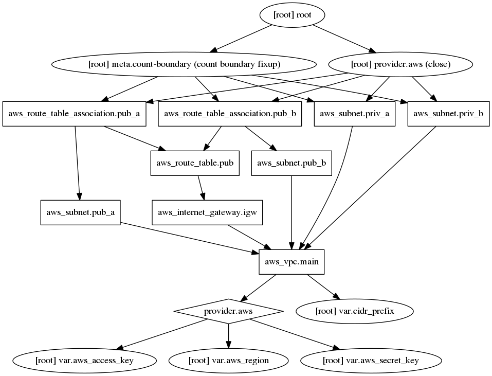

# Terraform

Terraform enables you to safely and predictably create, change, and improve infrastructure. It is an open source tool that codifies APIs into declarative configuration files that can be shared amongst team members, treated as code, edited, reviewed, and versioned.

## Overview
---

Terraform is the most popular cloud resource provisioning toolset in use today. It is the most important tool to use when deploying infrastructure on the cloud.

Terraform at it's core is a tool to call API's or scripts in a specific order. In a sense, most systems admin tasks and deployment pipelines break down to this. It does this by building a graph of different API calls and then traverses the graph calling each API in order. The order of these API calls is determined by providers of which there are many [official](https://www.terraform.io/docs/providers/index.html) and [unofficial](https://github.com/shuaibiyy/awesome-terraform#providers) providers which provide both API wrappers and interfaces to determine the order API calls need to be called in.

To drive the point home, consider a situation where you need to deploy a VPC network.  Inside that network resides subnets and other components to make the network work. Terraform calls these resources in order and can even output a visual representation of the graph per the diagram below.



Writing terraform is in all honesty pretty straightforward with all the examples you see out there. Small projects are very easy to setup and there are a ton of good examples to show you what to do. The hard part is knowing **exactly** what to do in how you setup your architecture but in many respects it's like playing with legos. You know you need a load balancer for instance, then you look up the load balancer in the docs, see the required interfaces, and then connect the dots. This is pretty straightforward as long as you know what you are trying to do, ie distribute traffic to a series of autoscaling group and have the traffic behave in a certain way.

The hard part about terraform is when your project grows and needs to integrate with a lot of different systems. This means that you might have an application running on a webserver but need to dynamically pull in information about the systems it touches which requires a little strategizing. For instance lets say you are in charge of running a webserver in a large deployment. You are not in charge of the network but your webserver needs to be deployed in 5 different VPCs. You can't hard code those VPCs because you don't want to look them up each time you deploy, thus you need to pull the vpc_id in dynamically.  In short, small deployments that you don't plan on changing much are pretty simple because you can put everything in one place.  Large deployments on the other hand require a little thought less you want to deal with a jungle of code.

## How to Use
---

There are four basic commands to run Terraform.

```
terraform init # Pulls down dependent providers and modules to be run locally
terraform plan # Mocks a deployment to verify that it will work properly
terraform apply # Applies the resources 
terraform destroy # Destroys the resources 
```
These commands cover the majority of what you should know when working with terraform.

To start a new module the "Insight" way, run the following cookiecutter.
```
pip3 install nukikata
nukikata https://github.com/insight-infrastructure/cookiecutter-terraform-terratest-aws
```

This will lay out a best practices approach to building a Terraform module.  Since Terraform largely focuses on building reusable modular sets of code, it is important to write tests to go along with your module to verify the functionality. The pattern for doing so includes writing fixtures in the `examples` directory and calling those fixtures from tests which we at Insight use a go package called terratest to do so. These fixtures are meant to demonstrate the use of the module in whatever context you expect the module to be used.

For instance, if writing a module to deploy an Airflow instance, you would want to run tests that verify that health checks properly came up after the module is deployed. Check out this [example](https://github.com/insight-infrastructure/terraform-aws-ec2-airflow/blob/master/test/terraform_defaults_test.go) of how that is done. To run the tests, run `make test` at the root of the repo.

Writing actual Terraform code is out of scope of this wiki. Please refer to the following tutorials.

## Terraform Tutorials
---

- [Insight's Terraform Tutorial](https://github.com/insight-infrastructure/terraform-aws-insight-tutorials)
    - This a multi-part lesson plan to go over the main parts of terraform
- [Anton Babanko's DevOps Unicorns Slides](https://www.slideshare.net/AntonBabenko/terraform-aws-modules-and-some-best-practices-september-2019)
    - These slides do an excellent job of highlighting some best practices from the man who maintains the largest open source terraform module repo
    - Must read for anyone new to terraform
- [An Introduction to Terraform by Jim Brikman](https://blog.gruntwork.io/an-introduction-to-terraform-f17df9c6d180)
    - **Most in depth tutorial**
    - Jim literally wrote the book on Terraform, Terraform Up and Running, and is the original author of Terragrunt, the leading wrapper to Terraform (more on this later).
    - This series is a little old but the basic parts of using Terraform have not changed. Read this to get a thorough review of how to use Terraform
- [A Beginner's Guide to Terraform - Linode](https://www.linode.com/docs/applications/configuration-management/beginners-guide-to-terraform/)
    - **Best beginners tutorial without going into too much stylistic descriptions**
    - Has up to date information with latest Terraform version
- [Creating your first Terraform infrastructure on AWS - Slalom Technology](https://medium.com/slalom-technology/creating-your-first-terraform-infrastructure-on-aws-ad986f952951)
    - **Least in depth tutorial**
    - Good to the point tutorial that gives you the bare minimum to see Terraform working

Anything that is not covered in these tutorials will be covered in the [docs](https://www.terraform.io/docs/index.html).

## Pain Points
---

- **Rapid Development**

Terraform is still in a v0 state (currently v0.13), meaning that there are expected to be changes to the system until it reaches a more stable v1 version. Recent changes in v0.13 include count and depends_on for modules.  Several other features are being built as the underlying HCL language evolves over time to include more features normally associated with imperitive languages.

- **Dealing with State**

When running any deployment, the state of the deployment needs to be tracked.  In professional settings, users rely on a remote state to manage this.  Recently Hashicorp began offering a free remote state backend. Before this, users either had to manage it themselves or relied on a tool called [Terragrunt]() to create and organize it for them. Having remote state is critical when working with production systems and in a team as it allows everyone to have a single source of truth of what the infrastructure looks like.

- **Unstable Providers and APIs**

Terraform by it's nature is wrapping other APIs which sometimes change. Especially when using new cloud services, expect that there might be small changes to the providers that will break. For this and other reasons, version controlling everything is very important.

- **Borked Deployments**

Sometimes when experimenting with Terraform it is possible to bork (totally mess up) your deployment. In this case you have to go into the console and manually delete resources.  In some cases, the resources created aren't available in the console and you have to delete them with the AWS CLI (IAM instance profiles for example).

