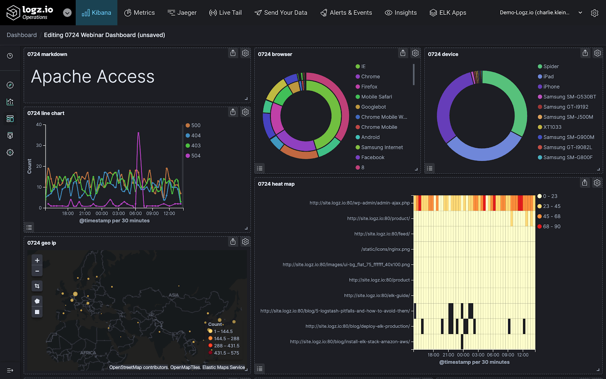

# Logz.io

Logz.io is a cloud observability platform providing Log Management built on the ELK Stack, Infrastructure Monitoring based on Grafana, and an ELK-based Cloud SIEM. The platform makes monitoring, troubleshooting, and securing applications much easier and much more scalable than the traditional ELK Stack.

## Overview

## Log Management

What's great about this ELK Stack-based monitoring through Logz.io is that the platform handles scaling, sharding, index management, upgrades, and everything else so that you can focus on your business rather than maintaining data pipelines.

Using Logz.io's Kibana and Grafana based technologies, you are able to see high-powered Kibana dashboards to find the information you my need. Log Patterns clusters similar logs together so you can quickly understand the log data generated by your environment, and you are even able to stay notified with real-time alerting using Slack, Opsgenie, PagerDuty, email, and other channels.

## Infrastructure Monitoring

Logz.io's open source technology also allows you to monitor metrics and identify trends across your entire cloud environment with familiar high resolution Grafana dashboards.

Cloud-native integrations make it easy to monitor technologies like Kubernetes, Amazon EC2, serverless, and more.
- Easily send metrics with lightweight open source agents or turn-key integrations with AWS or Azure
- 70+ premade dashboards purpose built to monitor and isolate key metrics
- New integrations and dashboards are constantly being added

## Cloud SEIM

Logz.io's Cloud SIEM is a powerful threat detection and investigation tool based on the open source ELK Stack. The platform delivers an easy-to-use cloud service at a fraction of the cost of other SIEMs.

With Cloud SIEM, you can leverage security rules and dashboards dedicated to identifying threats based on log data generated by AWS services like CloudTrail, CloudFront, and EC2 and identify Malicious IPs, URLs, and DNSs.

## Resources

- [The Complete Logz.io Documentation](https://docs.logz.io/)
- [How to Enable Server Monitoring with Logz.io](https://logz.io/blog/server-monitoring/)
- [Shipping Your Logs to Logz.io with Filebeat](https://logz.io/blog/shipping-logs-filebeat/)

## Pain Points

- Insert Here